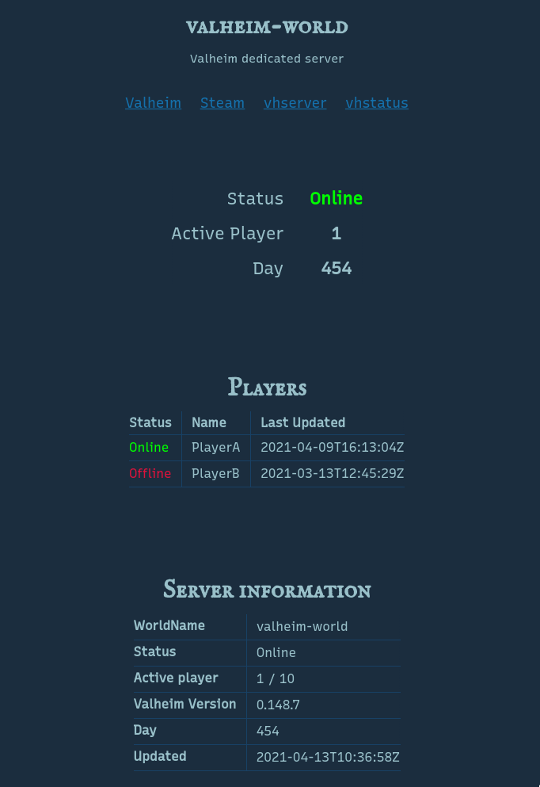

vhstatus
========

[](https://github.com/mitsu-ksgr/vhstatus/actions/workflows/test.yml)

This is a golang implementation of [cklokmose/vhstatus](https://github.com/cklokmose/vhstatus).

vhstatus provides a status page for a [valheim](https://www.valheimgame.com/) dedicated server deployed by [vhserver](https://linuxgsm.com/lgsm/vhserver/).


### Features.
- Status page (easy to customize)
	- server state
	- number of currently active player
	- the list of online and offline players
	- server information
- API Endpoint



### How to install
#### Prerequisite
- vhserver running on linux server.
- you must be able to ssh into vhserver.
- allow incoming TCP connections to port 8000.
    - the port number can be changed.

#### Setup vhstatus
work on your server.

```sh
$ sudo su vhserver
$ mkdir ~/vhstatus && cd ~/vhstatus

# Download vhstatus.zip
$ curl -LJO -H 'Accept: application/octet-stream' https://github.com/mitsu-ksgr/vhstatus/releases/download/v0.0.4/vhstatus.zip
$ unzip vhstatus.zip
$ rm vhstatus.zip
$ ls
vhstatus-server web

# Execute vhstatus
$ ./vhstatus-server -port 8000 -log-dir-path ~/log/console/ -template-dir-path ./web/ &
[1] 10679
```

now, you can access vhstatus: `http://{YOUR_SERVER_IP}:8000/`

if you can't to access the vhstatus page, please check the port settings of your valheim dedicated server.

#### Stop vhstatus
```sh
# Check the PID of vhstatus
$ ps aux | grep vhstatus
vhserver 10679  0.5  0.4 710372 16400 pts/0    Sl   19:18   0:00 ./vhstatus-server -port 8000 -log-dir-path /home/vhserver/log/console/ -template-dir-path ./web/

# and kill it.
$ kill 10679
```


### Test locally using docker-compose
```sh
$ docker-compose build
$ docker-compose up -d
```

and open http://localhost:8002/


### Development
#### Run tests
```sh
$ ./scripts/run_test.sh
```
